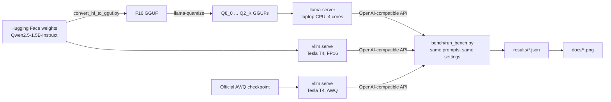
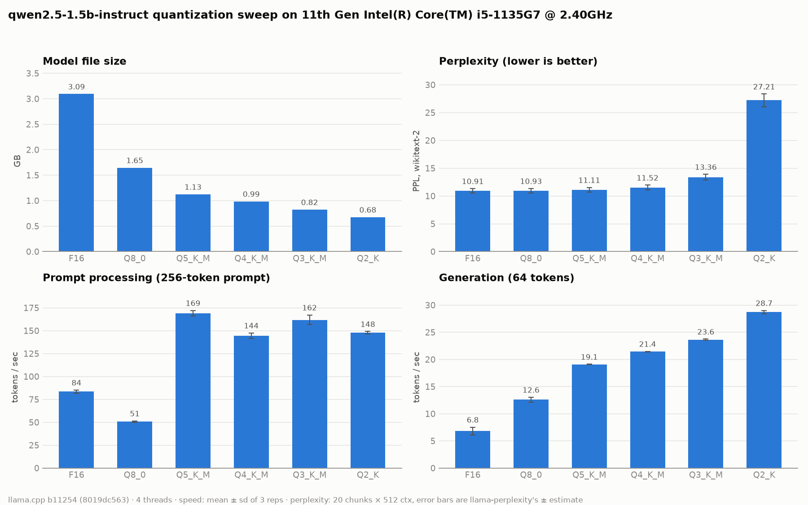
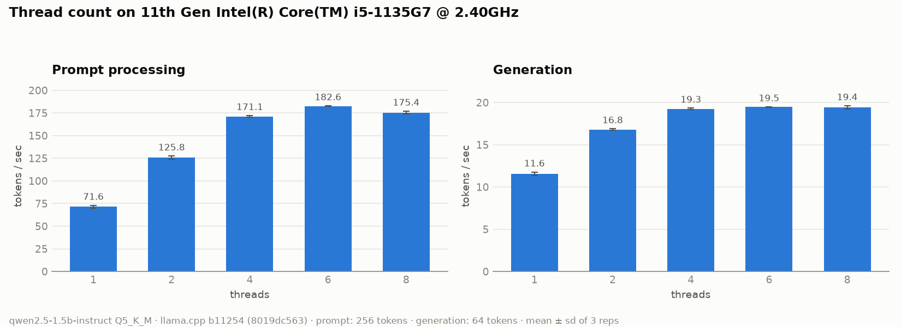
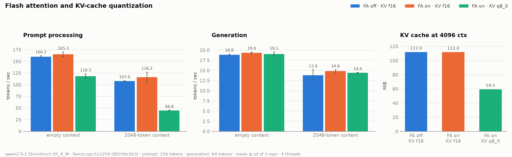
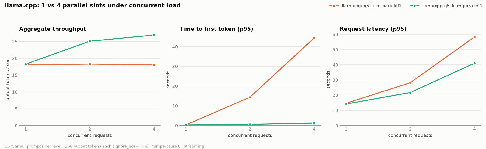
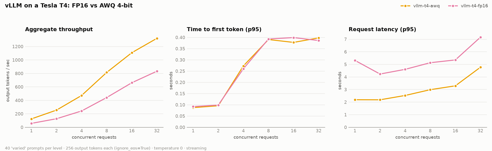
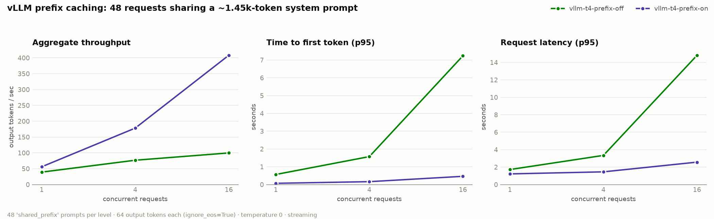
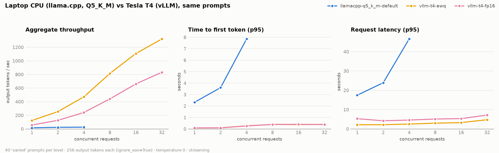

# serve_llm: one model, two engines

The same small LLM ([Qwen2.5-1.5B-Instruct](https://huggingface.co/Qwen/Qwen2.5-1.5B-Instruct)), served
two ways and measured with one benchmark harness:

- **llama.cpp on a laptop CPU.** Converted from the original Hugging Face weights and quantized
  here (no pre-made GGUFs), then tuned: threads, flash attention, KV-cache type, parallel slots.
- **vLLM on a free cloud GPU** (Kaggle, Tesla T4). FP16 and AWQ 4-bit under concurrent load,
  plus prefix caching on vs. off.

Every number and chart below is generated from the JSON files in [`results/`](results/).



## Quickstart (Windows, CPU only)

Needs [uv](https://docs.astral.sh/uv/) and about 13 GB of disk (weights, six GGUFs, and the converter's PyTorch). Each script skips work that is
already done. If PowerShell blocks scripts, run them as
`powershell -ExecutionPolicy Bypass -File .\llamacpp\<script>.ps1`.

```powershell
.\llamacpp\setup.ps1      # pinned llama.cpp build + source, HF weights, wikitext-2
.\llamacpp\convert.ps1    # HF safetensors -> F16 GGUF
.\llamacpp\quantize.ps1   # F16 -> Q8_0, Q5_K_M, Q4_K_M, Q3_K_M, Q2_K
.\llamacpp\serve.ps1      # tuned server on http://127.0.0.1:8080 (leave running)
uv run python -m serve_llm.smoke "Hello"   # in a second terminal
```

Reproduce the measurements:

```powershell
uv run python -m serve_llm.laptop_suite   # every laptop experiment, ~1.5 h on an idle machine
uv run python -m serve_llm.plot           # results/*.json -> docs/*.png
```

The GPU side runs in [`vllm/vllm_benchmark.ipynb`](vllm/vllm_benchmark.ipynb) on Kaggle (GPU T4,
internet on). The executed copy of the run behind these results is
[`vllm/vllm_benchmark_kaggle_run.ipynb`](vllm/vllm_benchmark_kaggle_run.ipynb).

## Hardware and versions

| | Laptop | Cloud GPU |
|---|---|---|
| Machine | Intel Core i5-1135G7 (4 cores / 8 threads), 31 GB RAM, Windows 11 | Kaggle: 1× Tesla T4 (16 GB), Xeon @ 2.0 GHz host |
| Engine | llama.cpp b11254 (`8019dc563`), CPU build | vLLM 0.31.0 |
| Weights | GGUF quantized here (Q5_K_M for serving) | FP16 (`--dtype half`, the T4 has no bf16), and Qwen's AWQ checkpoint |

## How it is measured

[`bench/run_bench.py`](bench/run_bench.py) is a single-file load tester (httpx + standard library)
for any OpenAI-compatible endpoint, so both engines run the exact same code.

- **Streaming requests** give time to first token (TTFT); `stream_options.include_usage` gives
  exact token counts instead of estimates.
- **`ignore_eos`**: every request generates exactly `max_tokens` (256), so both engines do the
  same amount of work. Every request in every run below generated exactly `max_tokens` tokens.
- **Cache-busting tag** at the start of each user message: each concurrency level re-sends the
  same prompts, and both engines cache prompt prefixes. Without the tag, later levels hit the
  cache and report artificially fast TTFT (this happened in an early test run). Only the
  chat-template prefix stays cacheable, as it would in real traffic.
- **Prompts**: 40 varied prompts (short questions to ~500-token passages) and a shared-prefix set
  of 12 questions over a ~1.45k-token system document, all written for this repo
  ([`bench/make_prompts.py`](bench/make_prompts.py)).
- **Laptop drift checks**: a reference `llama-bench` run before and after every experiment
  ([`results/reference_checks.json`](results/reference_checks.json)). See
  [Limitations](#limitations) for what it showed.

## Results: llama.cpp on the laptop

### Quantization: the quality cliff is below Q4



| Level | Size (GB) | Prompt (tok/s) | Generation (tok/s) | Perplexity (wikitext-2) | vs F16 |
|---|---|---|---|---|---|
| F16 | 3.09 | 84 | 6.8 | 10.91 ± 0.41 | — |
| Q8_0 | 1.65 | 51 | 12.6 | 10.93 ± 0.41 | +0.2% |
| **Q5_K_M** | **1.13** | **169** | **19.1** | **11.11 ± 0.42** | **+1.8%** |
| Q4_K_M | 0.99 | 144 | 21.4 | 11.52 ± 0.44 | +5.6% |
| Q3_K_M | 0.82 | 162 | 23.6 | 13.36 ± 0.53 | +22.5% |
| Q2_K | 0.68 | 148 | 28.7 | 27.21 ± 1.14 | +149.4% |

- **Generation speed tracks file size.** Generating each token reads the whole model from memory,
  so a smaller file is faster: 6.8 tok/s at F16, 28.7 at Q2_K.
- **Quality holds down to Q4, then collapses.** Q8_0 is indistinguishable from F16; Q3 and Q2 are not.
- **Q5_K_M is the pick for serving:** a third of Q4_K_M's quality loss for about 11% less generation speed.
- The ± values are llama-perplexity's own estimates over 20 chunks × 512 tokens. All levels are
  scored on the same text, so the differences between them are sharper than the bars suggest.
- F16 and Q8_0 prompt-processing speeds are **not reliable**: they moved by up to 70% between
  two clean runs, while the K-quants repeated within about 2%. No conclusion is drawn from them.

### Runtime tuning (Q5_K_M)



- **Threads:** generation stops improving at 4 threads (11.6 → 16.8 → 19.3 tok/s for 1/2/4, then flat).
  Once each physical core has a thread, memory bandwidth is the limit. Prompt processing,
  which is compute-bound, peaks at 6 threads (183 vs 171 tok/s at 4).



- **Flash attention:** about neutral on this CPU. It is slightly ahead at 2k context, but within
  run-to-run noise.
- **KV cache at q8_0 instead of f16:** halves KV memory (112 → 59.5 MiB at 4,096 context) but
  slows prompt processing by 28% at empty context and **2.6× at 2k context** (116 → 45 tok/s).
  Generation is unaffected. For a 1.5B model with grouped-query attention the KV cache is already
  small, so here the trade is not worth it.



| Concurrent requests | 1 slot: throughput | 1 slot: median TTFT | 4 slots: throughput | 4 slots: median TTFT |
|---|---|---|---|---|
| 1 | 18.1 tok/s | 0.28 s | 18.3 tok/s | 0.27 s |
| 2 | 18.3 tok/s | 14.2 s | 25.1 tok/s | 0.50 s |
| 4 | 18.1 tok/s | 42.3 s | 26.9 tok/s | 1.06 s |

- **Parallel slots** are the biggest win under load. With one slot, requests queue: throughput is
  flat and waiting time grows with every request. With four slots the CPU batches them: +49%
  throughput at 4 concurrent requests, and the first token arrives 40× sooner.
- Gotcha: passing `--parallel 4` explicitly splits the context per slot (4,096 / 4 = 1,024
  tokens each), which is too short for the 1.45k-token shared prompt. `serve.ps1` adds
  `--kv-unified` so all slots share one pool. Throughput is the same either way
  (26.4 vs 26.9 tok/s at 4 concurrent requests).

**Chosen configuration** ([`llamacpp/serve.ps1`](llamacpp/serve.ps1)): Q5_K_M, 4 threads,
4 slots, unified KV, flash attention on, f16 KV cache.

## Results: vLLM on a Tesla T4

### Continuous batching: throughput scales, latency barely moves



| Concurrent requests | FP16 throughput | FP16 p95 latency | AWQ throughput | AWQ p95 latency |
|---|---|---|---|---|
| 1 | 57.6 tok/s | 5.3 s | 124.3 tok/s | 2.2 s |
| 4 | 242.0 tok/s | 4.6 s | 472.2 tok/s | 2.5 s |
| 8 | 441.7 tok/s | 5.1 s | 814.8 tok/s | 3.0 s |
| 32 | 832.9 tok/s | 7.2 s | 1,321.4 tok/s | 4.8 s |

- **From 1 to 32 concurrent requests, FP16 throughput grows 14.5×** while p95 latency only goes
  from 5.3 to 7.2 s. vLLM schedules new requests into the running batch at every step
  (continuous batching), so extra users mostly fill idle GPU capacity instead of waiting in line.
- **AWQ 4-bit is 2.2× faster than FP16 at 1 request and 1.6× at 32.** This is the laptop's
  quantization lesson again: smaller weights move through memory faster. The gap narrows at high
  concurrency, where the GPU's compute becomes the limit. AWQ's quality cost was not measured here.

### Prefix caching: reuse the shared prompt instead of recomputing it



48 requests per level, each with the same ~1.45k-token system prompt and a different question
(64 output tokens). With caching on, 1,440 of each request's ~1,475 prompt tokens came from the
cache (reported by vLLM per request).

| Concurrent requests | Median TTFT off → on | p95 TTFT off → on | Throughput off → on |
|---|---|---|---|
| 1 | 0.54 → 0.06 s | 0.57 → 0.07 s | 39.3 → 56.1 tok/s |
| 4 | 1.34 → 0.14 s | 1.57 → 0.16 s | 76.8 → 178.3 tok/s |
| 16 | 2.51 → 0.34 s | 7.24 → 0.46 s | 99.9 → 408.3 tok/s |

At 16 concurrent requests, caching cuts p95 time to first token **16×** and raises throughput **4.1×**.
Without it, every request recomputes the same 1.4k tokens, and that work grows with the load.

## Head-to-head: laptop CPU vs. cloud GPU



Same 40 prompts, 256 output tokens each, same harness. In the TTFT panel the AWQ and FP16 lines
overlap: both stay under 0.4 s at every level.

| Concurrent requests | Laptop, llama.cpp Q5_K_M | T4, vLLM FP16 | T4, vLLM AWQ |
|---|---|---|---|
| 1: throughput | 16.8 tok/s | 57.6 tok/s (3.4×) | 124.3 tok/s (7.4×) |
| 1: median latency | 15.0 s | 4.5 s | 2.1 s |
| 4: throughput | 26.4 tok/s | 242.0 tok/s (9.2×) | 472.2 tok/s (17.9×) |
| 4: median latency | 38.5 s | 4.1 s | 2.1 s |
| 4: p95 TTFT | 7.85 s | 0.26 s | 0.27 s |
| Highest measured throughput | 26.9 tok/s (4 requests) | 832.9 tok/s (32 requests) | 1,321.4 tok/s (32 requests) |

This compares **two deployment profiles**, not two engines: different hardware and different
weight formats. It does not show that one engine is faster than the other.

## When to use which

These are interpretations of the measurements above.

**llama.cpp on a CPU fits when** there is one user or a handful, the data must stay on the
machine, and there is no GPU. A 1.5B model at Q5_K_M answers at ~19 tok/s on a 4-core laptop,
faster than most people read, in about 1 GB of memory. The ceiling is low: throughput tops out
around 27 tok/s, and at 4 concurrent requests the median request takes 38 s. Quantization does
most of the work on a CPU (2.8× faster generation from F16 to Q5_K_M at +1.8% perplexity); after
that, parallel slots matter more than threads, flash attention or KV-cache settings.

**vLLM on a GPU fits when** many users share one model. Continuous batching turned one T4 into
~830 tok/s (FP16) to ~1,320 tok/s (AWQ) at 32 concurrent requests, with p95 latency under 8 s.
Prefix caching is close to free and pays off whenever requests share a system prompt or
document. AWQ roughly doubles single-stream speed on this GPU; check its quality on your own
task before relying on it.

The choice is less about the engine and more about the shape of the traffic: a few users on
hardware you already own, or many users sharing a GPU.

## Limitations

- **One machine and one run per configuration.** The laptop results come from one session per
  experiment; the GPU results from one Kaggle session on one T4. There are no repeated runs or
  confidence intervals for the load tests.
- **The laptop slows down under sustained load.** In the reference checks, prompt speed fell
  from ~226–231 tok/s on a cool machine to ~169–176 tok/s within minutes and then held steady.
  Generation stayed at ~19.4 tok/s. The cause is most likely thermal, but clock speeds and
  temperatures were not logged. The first attention run coincided with this drop and was
  discarded; its replacement ran on an already-warm machine. Laptop numbers are steady-state
  figures.
- **Two reference checks show noise** (generation 15.9 ± 2.4 and 16.7 ± 2.1 tok/s), most likely
  brief background activity. The experiments just before them came out close to earlier clean
  runs: generation speeds within 8%, and the baseline load test within 4% at 1 and 4 concurrent
  requests, though 14% higher at 2 (24.0 vs 21.1 tok/s).
- **Synthetic traffic.** `ignore_eos`, temperature 0, fixed prompt sets, closed-loop concurrency
  (each client waits for its answer before sending the next request). Real traffic is burstier.
- **Quality was measured only for the GGUF quants,** with perplexity on 20 × 512 tokens of
  wikitext-2. AWQ quality was not measured.
- **The T4 is an older GPU** (Turing: no bf16, FP8 or FlashAttention-2 support). Newer GPUs would
  likely widen the gap.
- **Prefix caching was only measured on vLLM.** llama.cpp has its own per-slot prompt cache,
  which was not compared.

## What I'd do next

- **Separate engine from hardware:** run llama.cpp with CUDA on the same T4. That isolates
  "llama.cpp vs vLLM" from "CPU vs GPU".
- **A sharper quality metric:** KL divergence against F16 (`llama-perplexity --kl-divergence`)
  for the GGUF quants, and an equivalent check for AWQ.
- **Speculative decoding** on the laptop, with Qwen2.5-0.5B as the draft model (planned as optional, not done).
- **Open-loop load** (requests arriving at a fixed rate) to find each setup's real
  latency-vs-throughput limit.
- **Repeated runs** with confidence intervals, plus clock and temperature logging on the laptop.

## Repository layout

```
llamacpp/            setup, convert, quantize and serve scripts (PowerShell, pinned llama.cpp build)
bench/               run_bench.py (single-file load tester), prompts.jsonl + its generator
src/serve_llm/       quant_sweep, runtime_sweep, laptop_suite (experiment runners), plot, smoke
vllm/                Kaggle notebook + the executed copy behind these results
results/             raw JSON from every run (the source of every number above)
docs/                charts generated from results/
tests/               pytest suite (parsers, stats, charts, notebook validity); no model or server needed
```

## License

[MIT](LICENSE)
